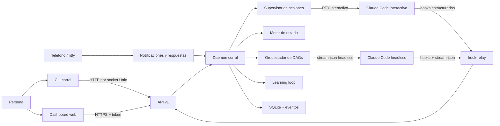
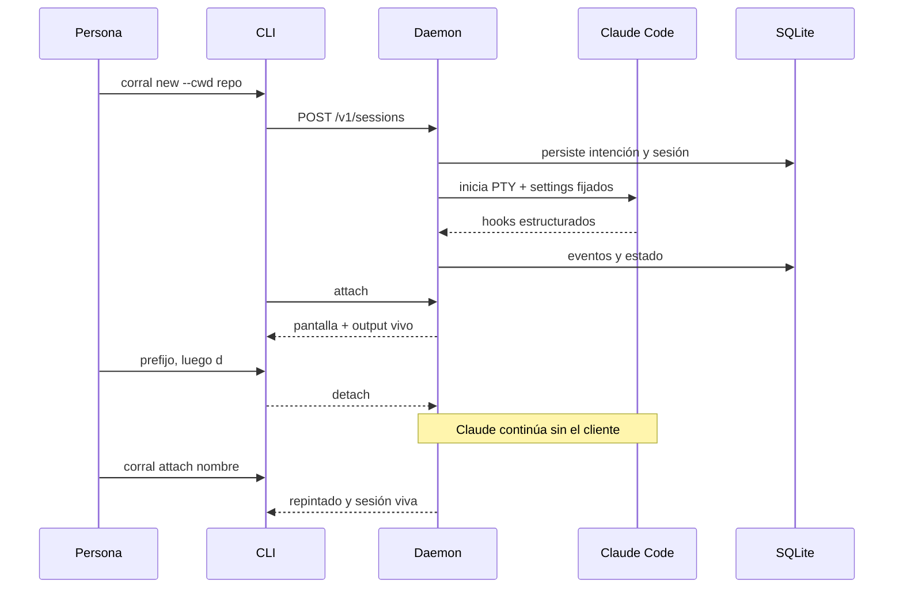
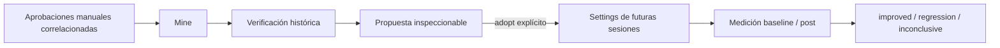

# Arquitectura de corral, explicada para humanos

Este documento explica cómo funciona corral sin exigir que el lector conozca
el historial M0–M6. Los documentos de `docs/design/` conservan los contratos y
decisiones detalladas; este manual presenta el sistema que existe hoy.

## 1. La idea en una frase

corral es un proceso local de larga duración que ejecuta y vigila sesiones de
Claude Code. El terminal desde el que trabaja una persona puede desaparecer,
pero la sesión sigue perteneciendo al daemon y puede volver a conectarse,
detenerse, reanudarse u orquestarse desde otro cliente.

La decisión central es separar tres responsabilidades:

- Claude Code realiza el trabajo y conserva la conversación.
- El daemon de corral conserva el proceso, el estado operativo y la historia.
- La CLI y el dashboard son controles reemplazables; no son dueños del agente.

## 2. Mapa general

El socket local predeterminado es `~/.corral/corral.sock`. El daemon no abre un
puerto de red a menos que el operador configure explícitamente
`daemon.listen`; cuando lo hace, TLS y bearer tokens son obligatorios.

## 3. Los componentes principales

### Daemon

`corral daemon` se relanza como un proceso separado, adquiere un lock exclusivo,
abre y migra SQLite, recupera sesiones anteriores y empieza a escuchar en el
socket Unix. Su estado operativo vive bajo `~/.corral/` por defecto.

El daemon conecta los demás subsistemas. También coordina un cierre ordenado:
deja de aceptar trabajo, finaliza streams, checkpointa sesiones, cierra los
workers y elimina socket y PID.

### Supervisor de sesiones

El supervisor es dueño de los procesos Claude Code. Mantiene un registro de
sesiones vivas, crea PTYs, conserva una representación de pantalla para poder
repintar al reconectar y controla attach, detach, input, resize, kill y wake.

Una sesión interactiva no depende del terminal cliente. `corral attach` sólo
transporta entrada y una imagen coherente del terminal entre el usuario y el
PTY que ya pertenece al daemon.

### Motor de estado

corral no deduce el estado leyendo texto del terminal. Claude Code ejecuta
hooks configurados por corral y el subcomando interno `hook-relay` envía eventos
estructurados al daemon. Con ellos, el motor distingue estados como:

- `starting`: el proceso está iniciando;
- `working`: hay actividad comprobada por hooks;
- `blocked`: Claude necesita permiso o input, con una razón estructurada;
- `idle`: terminó un turno y espera trabajo;
- `unknown` o `working?`: faltan hooks recientes y la observación puede estar
  degradada;
- `exited` o `failed`: el ciclo de vida del proceso terminó.

Una sesión detenida por el reaper conserva además información durable para que
`wake` pueda reanudarla, aunque `checkpointed` no sea un valor independiente de
la columna `STATE`.

El estado sólo cambia cuando existe evidencia. Enviar una respuesta no elimina
por sí mismo `blocked`; un hook posterior debe demostrar que Claude continuó.

### Checkpoint y recuperación

Claude Code conserva conversaciones en su propio directorio de sesiones.
corral conserva además el identificador de reanudación, eventos y output
necesario para distinguir un turno completo de uno interrumpido.

El reaper opcional puede checkpointar sesiones inactivas. `corral wake` las
reanuda con `claude --resume`. Durante el arranque, el daemon reconcilia la
intención persistida con los procesos encontrados antes de exponer la API.

### Orquestador headless

`corral run` convierte uno o más trabajos en un grafo acíclico dirigido (DAG).
Cada nodo guarda prompt, repositorio, modelo, intentos, presupuesto y
dependencias. Un nodo sólo queda listo cuando todos sus predecesores terminan
con éxito.

Los nodos se ejecutan con Claude Code en modo `stream-json`, no en un PTY. El
orquestador captura resultado y costo, aplica reintentos y límites, y puede
crear un git worktree y una rama aislados por tarea.

### Store y eventos

SQLite es la fuente durable bajo `~/.corral/corral.db`. El esquema contiene:

- sesiones y su intención de ejecución;
- un log de eventos append-only;
- tareas, dependencias y presupuestos de DAG;
- hashes y metadatos de tokens de API;
- candidatos, evidencia y mediciones del learning loop.

Las tablas de aprendizaje son proyecciones consultables. Los eventos siguen
siendo la evidencia atribuible. Los tokens se almacenan como hash SHA-256; el
secreto en texto plano sólo se muestra al crearlo.

## 4. Flujo de una sesión interactiva

Los settings que corral pasa con `--settings` están en su directorio de estado;
no necesita editar archivos del repositorio ni los settings globales de Claude.

## 5. Flujo de aprendizaje M6

El primer tipo de aprendizaje implementado es una regla exacta de permiso Bash:

Las protecciones importantes son:

- una aprobación automática no cuenta como aprobación humana;
- la regla propuesta es exacta, no un wildcard más amplio;
- verificar o proponer sólo escribe en el estado de corral;
- adoptar requiere una acción explícita y afecta sesiones futuras;
- las reglas `ask` o `deny` administradas por Claude conservan precedencia;
- el reporte exige denominadores visibles;
- el reporte normal usa 14 días y `--early` sólo persiste si ambas muestras
  ya alcanzan 5 sesiones y 3 tareas terminales;
- cada aprendizaje tiene una única medición por fase y un TTL.

## 6. API y clientes

La API HTTP `/v1` se usa tanto local como remotamente. Sus grupos principales
son metadatos/configuración, sesiones, attach, hooks, DAGs, dashboard, eventos
SSE, tokens y learnings.

En local, la seguridad primaria es el socket Unix con permisos restringidos.
En remoto:

- no existe TCP sin TLS;
- un token `admin` tiene control completo;
- un token `session` queda confinado al subárbol de esa sesión;
- el dashboard estático puede cargarse sin token, pero todos sus datos y
  acciones requieren autenticación;
- el attach de PTY sigue siendo local; para operación remota se usa dashboard
  o comandos compatibles con `--host`.

La versión de API actual es 1. Los clientes envían un handshake de versión para
detectar incompatibilidades en lugar de interpretar respuestas incorrectas.

## 7. Configuración y frontera de confianza

Hay dos archivos posibles:

- `~/.corral/config.toml`: configuración confiable del operador;
- `.corral.toml`: configuración cercana al repositorio y, por definición,
  contenido no confiable.

La precedencia de sesión es: defaults → archivo del usuario → archivo del repo
→ variables `CORRAL_*` → override explícito de la solicitud.

Un repositorio sólo puede ajustar `session.model`, `session.term` y
`session.scrollback_lines`. No puede elegir el binario, propagar variables,
abrir red, cambiar TLS, habilitar notificaciones, modificar permission mode,
debilitar los umbrales de aprendizaje ni redirigir el cliente. `corral config`
muestra el valor resuelto, su fuente y las claves del repo que fueron ignoradas.

El daemon congela al arrancar un snapshot mínimo de variables permitidas. Esto
evita heredar indiscriminadamente todo el entorno del usuario hacia procesos
agente. Si se cambia una variable que debe llegar a Claude, hay que reiniciar el
daemon.

## 8. Archivos importantes en disco

Con la configuración predeterminada:

| Ruta | Función |
|---|---|
| `~/.corral/config.toml` | Configuración del operador |
| `~/.corral/corral.db` | SQLite durable |
| `~/.corral/corral.sock` | API local |
| `~/.corral/daemon.pid` | PID del daemon |
| `~/.corral/daemon.lock` | Exclusión de instancia única |
| `~/.corral/daemon.log` | Log del daemon separado |
| `~/.corral/` | Settings fijados, logs de sesión y demás estado privado |

El directorio se fuerza a modo `0700`; los archivos sensibles usan permisos
restrictivos. No se recomienda editar la base ni los settings generados.

## 9. Mapa del código

| Área | Responsabilidad |
|---|---|
| `cmd/corral` | CLI, parsing y presentación humana/JSON |
| `internal/daemon` | Arranque, wiring, recovery y shutdown |
| `internal/supervisor` | PTY, sesiones vivas, attach y headless runner |
| `internal/state` | Máquina de estados basada en hooks |
| `internal/checkpoint` | Checkpoint y resume |
| `internal/orchestrator` | DAG, dependencias, reintentos y costos |
| `internal/api` | API, auth, scopes, SSE y dashboard embebido |
| `internal/store` | SQLite, migraciones y consultas |
| `internal/learning` | Minería, verificación, adopción y medición |
| `internal/notify` | ntfy, webhook y canal de respuestas |
| `internal/claude` | Contratos específicos de Claude Code |
| `internal/config` | Capas de configuración y frontera repo/operador |
| `internal/git` | Worktrees aislados para tareas |
| `internal/version` | Identidad de versión, commit y compatibilidad API |
| `test/fakeclaude` | Sustituto determinista de Claude para pruebas |
| `.goreleaser.yml` | Matriz y metadata reproducible de artefactos M7B |
| `scripts/release` | Gates independientes para tags, CI y archivos |

### Cadena de suministro de M7B

Un tag anotado no publica inmediatamente una release visible. El workflow
comprueba primero que el SHA ya pasó CI en macOS y Linux. GoReleaser compila
cuatro binarios con Go 1.26.5, rutas recortadas, CGO deshabilitado y timestamps
del commit; después crea archives, SHA-256 y SBOMs SPDX.

La publicación nace como draft privado. Un verificador separado abre cada
archive, rechaza rutas inseguras, comprueba inventario, checksums, SBOM y la
metadata `versión|commit|API` embebida. Sólo entonces el draft se vuelve
visible. Dos clones en rutas distintas deben producir archives byte a byte
idénticos. El contrato detallado vive en
[`docs/design/m7b.md`](../design/m7b.md) y la operación humana en el
[runbook de releases privadas](RELEASES_PRIVADAS.md).

## 10. Qué está completo y qué no

La línea funcional M0–M6 está cerrada en `v0.6.0`: sesiones interactivas,
hooks, notificaciones, checkpoint/recovery, DAGs, acceso remoto, dashboard y el
primer learning loop verificado. M7A ya estableció el repositorio privado,
identidad legal y CI protegida. M7B añade el pipeline reproducible de releases;
M7 no se cierra hasta completar daemon, servicios, instalador, operación de
datos y smoke de upgrade.

El proyecto continúa en pre-alpha. El orden, dependencias y gates están en el
[plan ejecutable post-M6](../roadmap/POST_M6.md). Los pendientes principales
son:

1. instalador, Homebrew privado, firma y notarización;
2. `corral service install` para launchd/systemd y operación al iniciar sesión;
3. completar el smoke de publicación, instalación y upgrade de `v0.7.0`;
4. comandos seguros para aceptar o descartar worktrees desde `corral review`;
5. E2E con navegador real, además del E2E HTTP ya existente;
6. Windows, modo multiusuario/equipo y más notificadores;
7. las siguientes familias de aprendizaje: memoria operacional, routing de
   modelo, síntesis de skills y corpus de regresión;
8. funciones avanzadas de flota descritas en el runbook, como scheduling por
   cuota y una superficie MCP.

Estas extensiones no impiden usar el núcleo actual, pero sí importan antes de
presentarlo como producto estable para instalación general.

Para operar el sistema paso a paso, continúe con la
[Guía humana de uso](GUIA_DE_USO.md).
