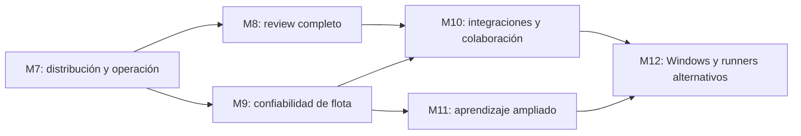

# Plan ejecutable después de M6

**Estado:** M7 cerrado en la release privada estable `v0.7.0`; M8 en
ejecución. **Punto de partida de M8:** tag anotado `v0.7.0` sobre `bca30e3`.

**M7A:** integrado en
[`djbu/corral#1`](https://github.com/djbu/corral/pull/1). Los pasos 46–47
pasaron localmente y en la matriz GitHub Actions de macOS/Linux. **M7B:**
implementado y validado de extremo a extremo en
[`djbu/corral#2`](https://github.com/djbu/corral/pull/2); contrato en
`docs/design/m7b.md` y evidencia en `docs/dogfood/m7b.md`.
**M7C:** integrado mediante `djbu/corral#3`. **M7D:** implementa el paso 52;
contrato en `docs/design/m7d.md` y evidencia en `docs/dogfood/m7d.md`.

Este documento ordena los pendientes que quedaron después de M6. No es una
lista de deseos: cada fase tiene dependencias, entregables, pruebas y una
condición explícita de cierre.

## 1. Principio de orden

El núcleo funciona, pero todavía es pre-alpha. El siguiente trabajo debe
reducir primero el riesgo de entregar y operar el producto; después puede
ampliar workflows, escala, plataformas y aprendizaje.



M7 es el único próximo milestone. M8 y M9 pueden diseñarse en paralelo después
de cerrar M7, pero no deben implementarse simultáneamente en el mismo árbol.
M10–M12 son horizontes ordenados: antes de empezarlos se actualiza su diseño
con lo aprendido en producción.

## 2. Reglas de ejecución

Cada milestone seguirá este ciclo:

1. crear una rama `codex/mN-nombre` desde el último tag estable;
2. congelar contrato, amenazas y criterios de salida en `docs/design/mN.md`;
3. dividir el código en commits pequeños, cada uno con pruebas;
4. mantener `go test ./...` y `go test -race ./...` verdes;
5. dogfood en un directorio de estado separado antes de tocar el estado real;
6. actualizar los dos manuales humanos;
7. ejecutar build, vet, race, integración real relevante y smoke de upgrade;
8. crear un tag anotado sólo sobre un árbol limpio y exactamente validado.

Una funcionalidad que requiera credenciales, cuenta externa, firma o cambio
externo de repositorio se prepara completamente, pero se detiene antes de la
acción externa hasta contar con la decisión o secreto del operador.

## 3. Decisiones externas que hay que resolver

Estas decisiones no bloquean escribir código local, pero sí el cierre de M7 o
de los milestones indicados:

| Decisión | Necesaria para | Valor recomendado |
|---|---|---|
| Nombre y owner/org de GitHub | Repositorio M7 | **Decidido:** `djbu/corral` |
| Visibilidad | Repositorio M7 | **Decidido:** privado |
| Licencia | Baseline legal M7 | **Decidido:** Apache-2.0 |
| URL del remote | CI y releases M7 | **Decidido:** `https://github.com/djbu/corral` |
| Apple Developer ID/notarización | Distribución macOS estable | Posponer firma sólo para una preview claramente marcada |
| Canal de instalación | Distribución M7 | Release privada autenticada; Homebrew público diferido |
| Modelo comercial de equipos | M10 | OSS single-user completo; colaboración como capa adicional |
| Prioridad Windows frente a nuevas learnings | M11/M12 | Learnings primero salvo demanda real de Windows |

No se deben guardar tokens de GitHub, Apple, Slack o Telegram en el repositorio.

## 4. M7 — Distribución, CI y operación (`v0.7.0`)

### Objetivo

Pasar de “se puede compilar desde el checkout” a “una persona puede instalar,
actualizar, arrancar, detener, diagnosticar y desinstalar una release verificable
sin conocer el código”.

### Pasos

#### 46. Identidad y baseline legal

- usar `corral` como nombre, `djbu` como owner,
  `https://github.com/djbu/corral` como URL canónica y visibilidad privada;
- migrar el módulo Go desde su ruta provisional a
  `github.com/djbu/corral` en una operación mecánica verificada;
- añadir `LICENSE`, copyright y política de contribución mínima;
- registrar ADR de licencia, telemetría y nombre;
- corregir metadatos que todavía asumen un repositorio sin remote.

**Gate:** el contenido puede almacenarse y distribuirse internamente bajo la
licencia elegida, el remote confirma visibilidad privada y `go list ./...` no
contiene rutas de módulo equivocadas para la ubicación elegida.

#### 47. CI obligatoria para cada cambio

- crear `.github/workflows/ci.yml` para push y pull request;
- matriz macOS/Linux, amd64/arm64 donde el runner lo permita;
- ejecutar formato, `go vet`, build sin cgo y `go test -race ./...`;
- conservar el contrato Claude real como workflow nocturno/manual separado;
- subir logs útiles cuando una integración falle;
- añadir protección de rama una vez exista el remote.

**Gate:** el mismo commit pasa localmente y en ambos sistemas; ninguna prueba
normal requiere red, cuenta Claude ni secretos.

#### 48. Build reproducible de release

- añadir `.goreleaser.yml` o configuración equivalente;
- compilar darwin/linux × amd64/arm64 con `Version` y `Commit` inyectados;
- producir archivos versionados, checksums y SBOM;
- documentar cómo reproducir un artefacto desde un tag;
- añadir prueba que abre cada archivo y verifica `corral --version`.

**Gate:** dos builds limpios del mismo tag producen el mismo inventario y cada
binario anuncia `0.7.0`, commit correcto y API 1.

#### 49. Workflow de publicación

- disparar sólo desde tags `v*`;
- exigir que CI del commit ya esté verde;
- publicar artefactos, checksums, SBOM y notas como release privada de GitHub;
- fallar si el tag no es anotado, el árbol no corresponde o la versión diverge;
- documentar rollback y revocación de una release defectuosa.

**Gate:** una prerelease de prueba se crea desde un tag temporal y se verifica
de extremo a extremo antes de habilitar la release final.

#### 50. Ciclo de vida del daemon

**Estado M7C:** implementado y validado mediante PR `djbu/corral#3`.

- añadir `corral daemon status|stop|restart` sin depender de comandos shell;
- hacer idempotentes start, stop y restart;
- distinguir daemon ausente, PID obsoleto, lock vivo y shutdown en progreso;
- probar cierre con sesiones interactive/headless activas.

**Gate:** nunca se necesita SIGKILL en el camino normal y un restart conserva
sesiones recuperables.

#### 51. Servicio del usuario

**Estado M7C:** implementado y validado mediante PR `djbu/corral#3`.

- añadir `corral service install|status|uninstall`;
- launchd en macOS y systemd user service en Linux;
- generar archivos desde plantillas deterministas y rutas absolutas;
- evitar root y no copiar secretos dentro del plist/unit;
- soportar upgrade del binario sin perder la definición del servicio;
- probar crash/restart y login/logout en entornos aislados.

**Gate:** el servicio arranca al iniciar sesión, reinicia tras crash, se detiene
ordenadamente y uninstall no borra datos del usuario sin confirmación aparte.

#### 52. Instalador privado y preparación de Homebrew

**Estado M7D:** implementado y validado localmente; el smoke autenticado sobre
release/VM limpia se repite como parte del paso 54.

- implementar un instalador que detecte OS/arquitectura;
- descargar una versión explícita desde la release privada usando credenciales
  por entorno o instalar desde un archivo offline;
- verificar checksum y hacer reemplazo atómico;
- no usar `sudo` por defecto; instalar en una ruta del usuario;
- soportar `--version`, `--prefix` y modo dry-run;
- preparar y probar una fórmula/tap Homebrew sin publicarla mientras el
  repositorio y sus artefactos sean privados;
- documentar instalación offline y desinstalación.

**Gate:** una VM limpia y autenticada instala, ejecuta y desinstala sin residuos
fuera de las rutas documentadas; una VM sin credenciales falla claramente y un
checksum inválido aborta sin reemplazar el binario.

#### 53. Operación de datos

**Estado M7E:** implementado; contrato en `docs/design/m7e.md` y evidencia en
`docs/dogfood/m7e.md`.

- añadir `corral backup` con snapshot consistente de SQLite;
- añadir `corral gc --dry-run` y políticas por edad/tamaño;
- ejecutar WAL checkpoint de forma segura y `VACUUM` sólo bajo condiciones
  documentadas;
- añadir alerta de poco disco y rechazo explícito de nuevos spawns antes de
  corromper el estado;
- definir restore y downgrade: una DB más nueva debe fallar claramente.

**Gate:** backup→restore conserva sesiones, DAGs, tokens revocados y learnings;
GC nunca borra evidencia todavía referenciada.

#### 54. Smoke de instalación y upgrade

**Estado M7F:** completado con `v0.7.0-rc.2` en runners limpios macOS/Ubuntu;
promoción final `v0.7.0`. Contrato en `docs/design/m7f.md` y evidencia en
`docs/dogfood/m7f.md`.

- VM limpia por plataforma: instalar `v0.6.0`, crear estado y sesión fake;
- actualizar al release candidate `v0.7.0`;
- comprobar migraciones, restart, attach/wake y uninstall;
- repetir con TLS remoto y token;
- actualizar guía de uso y arquitectura.

**Cierre de M7:** CI verde, artefactos verificables, instalación limpia,
servicio estable, backup/restore probado y tag anotado `v0.7.0`.

## 5. M8 — Cierre del workflow de review (`v0.8.0`)

### Objetivo

Convertir los worktrees aislados en un ciclo completo y seguro: inspeccionar,
aceptar o descartar, sin pedir al usuario que reconstruya manualmente el estado
con Git.

### Pasos

#### 55. Contrato de revisión

**Estado:** completado; contrato congelado en `docs/design/m8.md`.

- definir estados `pending_review`, `released` y `discarded` sin reinterpretar
  tareas ya persistidas;
- decidir políticas para working tree sucio, commits adicionales, branch
  adelantada y base divergente;
- registrar toda mutación como evento auditable.

#### 56. Release seguro

**Estado:** completado en implementación y smoke local.

- endpoint y CLI `corral review release <task>`;
- preflight sin escritura: repo, base, diff, conflictos y ownership;
- estrategia explícita elegida por el operador: merge, cherry-pick o sólo
  conservar rama;
- ninguna resolución automática de conflictos;
- transacción lógica que nunca marque released si Git falló.

#### 57. Descarte recuperable

**Estado:** completado en implementación y smoke local.

- endpoint y CLI `corral review discard <task>`;
- por defecto conservar una referencia/ref de recuperación antes de retirar el
  worktree;
- `--force` separado y con target resuelto exactamente;
- no borrar una rama con commits no atribuibles a la tarea.

#### 58. Dashboard y browser E2E

**Estado:** completado; evidencia y límite del diálogo nativo documentados en
`docs/dogfood/m8.md`.

- mostrar diff, preflight y acciones release/discard en el dashboard;
- confirmaciones con identidad exacta de repo, rama y commit;
- E2E opt-in con navegador real sobre TLS + bearer + SSE;
- mantener las pruebas HTTP deterministas en el suite normal.

#### 59. Dogfood de review

**Estado:** implementación y dogfood local completos; promoción RC/estable
pendiente.

- ejecutar DAGs reales en worktrees;
- probar camino feliz, conflicto, cancelación y recuperación tras crash;
- demostrar que ningún cambio entra a la rama principal sin acción humana.

**Cierre de M8:** un DAG real completa el ciclo create→work→review→release y
otro review→discard recuperable; browser E2E verde; tag `v0.8.0`.

## 6. M9 — Confiabilidad de flota (`v0.9.0`)

### Objetivo

Operar muchas sesiones durante semanas sin crecimiento ilimitado, colisiones de
cuota ni deriva silenciosa de Claude Code.

### Pasos

#### 60. Límites y backpressure

- máximo configurable de sesiones interactivas y tareas headless;
- cola justa con prioridad interactiva;
- límites de logs, eventos y espacio disponible;
- estados y errores explícitos cuando el sistema rechaza trabajo.

#### 61. Soak y leak detection

- 50 sesiones concurrentes bajo `-race`;
- 1000 ciclos spawn/kill/resume en job nocturno;
- umbrales de file descriptors, goroutines, RSS y tamaño de WAL;
- perfiles y artefactos al superar el baseline.

#### 62. Pin y compatibilidad de Claude

- registrar versión observada por sesión;
- política por repo: versión esperada/rango compatible sin ejecutar un binario
  suministrado por el repo;
- `corral doctor` alerta drift y corpus golden faltante;
- workflow que abre una tarea al detectar nueva versión upstream.

#### 63. Session templates

- templates confiables del usuario para modelo, entorno permitido, presupuesto,
  reaper y notificadores;
- el repo sólo puede seleccionar templates previamente autorizados;
- `corral new --template` y nodos DAG con referencias auditables.

#### 64. Scheduling por cuota

- modelo de ventanas de uso separado de costo monetario;
- prioridad, pausa y resume deterministas;
- reserva para sesiones interactivas;
- simulador con reloj falso antes de dogfood real.

#### 65. MCP de corral

- exponer status/run/wait con tipos estables;
- reutilizar tokens scoped, presupuestos y límites de DAG;
- impedir que un agente amplíe su propio scope;
- contract tests cliente↔servidor y documentación humana.

**Cierre de M9:** soak nocturno estable, límites comprobados, drift visible,
cuota simulada y real sin 429 evitables, MCP confinado; tag `v0.9.0`.

## 7. M10 — Integraciones y colaboración

M10 se divide en dos releases porque mezclar canales externos con una nueva
frontera multiusuario haría demasiado grande la revisión de seguridad.

### M10a. Notificadores Slack/Telegram

#### 66. Interfaz común de conversación

- normalizar identidad de mensaje, deduplicación, ack y respuesta;
- conservar ntfy/webhook sin cambios de contrato;
- redactar payloads antes de salir del host.

#### 67. Backends y respuestas

- Slack y Telegram con scopes mínimos;
- allowlist de usuarios/chats confiables;
- replay protection y expiración de respuestas;
- servidores fake en tests; red real sólo en gates opt-in.

**Cierre M10a:** blocked→notify→reply→continue funciona en ambos canales sin
exponer tokens ni aceptar usuarios fuera de allowlist.

### M10b. Multiusuario y equipos

#### 68. Modelo de tenancy y amenazas

- owner, member, viewer y service identity;
- aislamiento por repo/team y ownership de sesiones;
- política de learnings compartidos con consentimiento y procedencia.

#### 69. Auth y autorización

- reemplazar el supuesto single-user en todas las rutas;
- rotación, expiración y auditoría de credenciales;
- matriz ejecutable de cada rol × endpoint × recurso.

#### 70. Fleet memory sync

- formato versionado, firmas/procedencia y conflictos;
- propuesta antes de importar una regla que amplía permisos;
- export/import reversible y sin servidor obligatorio para single-user.

**Cierre M10b:** pruebas de aislamiento negativas, auditoría completa y dogfood
con dos identidades reales; single-user conserva compatibilidad.

## 8. M11 — Ampliación del learning loop

Cada familia se entrega por separado y reutiliza el contrato M6: evidencia →
verificación → propuesta → adopción explícita → medición → TTL/regresión.

#### 71. Memoria operacional

- extraer hechos repetidos de repo;
- verificar contra tareas históricas y vigencia actual;
- inyectar memoria adoptada en SessionStart sin escribir el repo;
- medir reintentos, correcciones y éxito.

#### 72. Routing de modelo

- clasificar tipos de tarea con features no sensibles;
- comparar éxito/costo/latencia por tier;
- recomendar primero; no cambiar modelo silenciosamente;
- exploration budget y rollback ante regresión.

#### 73. Síntesis de skills

- detectar procedimientos repetidos;
- generar `SKILL.md` en sandbox de estado;
- replay/regression antes de propuesta;
- exportar al filesystem sólo mediante acción explícita y diff visible.

#### 74. Corpus de regresión

- capturar fallos reproducibles con redacción;
- `corral regress` con fixtures estables y presupuestos;
- ejecutar antes/después de cambios de config, memoria o skill;
- resultados atribuibles y retención configurable.

**Cierre de M11:** cada tipo tiene al menos un dogfood real medido, no sólo
generación de texto; una regresión sintética activa su protección.

## 9. M12 — Portabilidad y runners alternativos

### Windows

#### 75. Spike de riesgos

- ConPTY, process groups, signals, locks, Unix socket replacement y servicios;
- SQLite/path semantics y Git worktrees;
- decidir soporte nativo o WSL como producto oficial.

#### 76. Abstracciones de plataforma

- interfaces pequeñas para PTY, process lifecycle, IPC, lock y servicio;
- mantener implementaciones Unix sin regresión;
- CI Windows desde el primer adapter, no al final.

#### 77. Paridad y documentación

- sesiones, headless, recovery y remote con gates por plataforma;
- declarar explícitamente cualquier feature Unix-only restante.

### Agent SDK runner

#### 78. Spike comparativo

- capacidades, hooks, resume, permisos, costos y compatibilidad;
- mismo scenario contract contra CLI y SDK;
- medir complejidad y comportamiento, no asumir superioridad.

#### 79. Runner intercambiable

- interfaz detrás de `internal/claude`;
- selección confiable del operador, nunca del repo;
- migración y rollback sin cambiar el store público.

**Cierre de M12:** decisión documentada Windows/WSL, runner SDK opcional con
paridad probada o rechazo explícito basado en evidencia.

## 10. Orden de trabajo inmediato

La primera tanda concreta es:

- [x] 46 — identidad, licencia, remote privado y módulo canónico;
- [x] 47 — CI normal macOS/Linux;
- [x] 48 — build reproducible y checksums;
- [x] 49 — workflow de prerelease/release;
- [x] 50 — `daemon status|stop|restart`;
- [x] 51 — servicio launchd/systemd;
- [x] 52 — instalador privado y fórmula Homebrew no publicada, una vez estable
  el ciclo del servicio;
- [x] 53 — backup/GC/disco;
- [x] 54 — smoke limpio y tag `v0.7.0`.

El orden 50→51→52 es deliberado: no se debe distribuir un servicio antes de
tener un ciclo de vida estable, ni distribuir un instalador antes de conocer
las rutas y archivos finales del servicio. La publicación pública de Homebrew
queda fuera de M7 mientras `djbu/corral` sea privado.

## 11. Validación estándar de cada release

Como mínimo, el commit que recibe un tag debe pasar:

```sh
node --check internal/api/dashboard/app.js
go build ./...
go vet ./...
go test -race ./...
CORRAL_E2E_REAL_CLAUDE=1 go test ./internal/supervisor \
  -run '^TestLearningRuleE2E_RealClaude$' -count=1 -v
```

Además se ejecutan los gates específicos del milestone, upgrade desde la última
release y verificación de árbol limpio. Los tests con cuentas externas nunca
reemplazan el suite determinista; lo complementan.

## 12. Definición de “producto estable”

No se elimina la etiqueta pre-alpha sólo por acumular features. Como mínimo:

- dos releases consecutivas instalables y actualizables sin pérdida de datos;
- CI macOS/Linux estable y soak nocturno sin fugas;
- restore comprobado desde backups reales;
- política de compatibilidad y de vulnerabilidades publicada;
- instalación, servicio, upgrade y uninstall probados por una persona distinta
  del autor;
- ninguna operación destructiva importante depende de editar SQLite o ejecutar
  comandos Git improvisados.

Hasta entonces, el README debe seguir diciendo pre-alpha aunque el milestone
funcional correspondiente esté completo.
